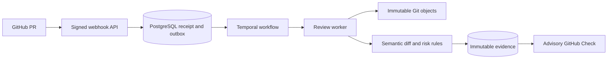

# AgentCI

**An agent-first CI/CD platform and engineering control plane.**

AgentCI is being built for agents as first-class participants in software delivery:
understanding intent, proposing changes, evaluating behavior and coordinating
releases through explicit APIs, policy boundaries and verifiable evidence. Humans
retain visibility and authority over consequential decisions.

The platform connects specifications, pull requests, evaluations, runtime signals
and release decisions. Its first working milestone reviews changes to requirements,
permissions, tools, models, prompts and dependencies, then publishes an advisory
GitHub Check. That is the first capability of the control plane, not its full scope.

[Try M1](#quickstart) · [Architecture](#architecture) · [Demo](docs/dogfood/m1-release-demo.md) · [Roadmap](docs/milestone-gates.md) · [Contributing](#contributing)

## Why AgentCI?

Agent-driven development needs more than a pipeline that runs commands. Agents
need machine-readable intent, stable interfaces, durable state and feedback they
can use to decide the next action. Reviewers need to see what happened, why, and
which evidence supports a delivery decision. AgentCI aims to connect that loop
across CI/CD while integrating with existing execution and deployment systems.

A passing build tells you whether existing checks passed. It may not explain
whether a prompt lost a safety constraint, a tool gained production-write access,
or a model configuration changed. Those changes can alter an agent's behavior
without looking like a conventional code defect.

AgentCI makes these changes visible and connects each review to exact Git commits
and retained evidence. The goal is a reviewable chain from intended requirements
to observed behavior and release decisions. Behavioral evaluations, tracing,
production feedback and repair are later milestones; M1 delivers the first link:
deterministic semantic PR review.

## Principles

- **Design for agents first.** Machine-readable contracts, explicit outcomes and
  traceable evidence are primary interfaces; human review remains an authority boundary.
- **Close the delivery feedback loop.** Connect intent, change, evaluation, release
  and runtime feedback so agents can act on evidence within policy.
- **Build on existing systems.** Git owns source history; existing CI executes
  jobs. Temporal coordinates durable workflows. OpenTelemetry and MCP are the
  planned tracing and tool integration standards.
- **Keep evidence tied to identity.** Reviews identify immutable base/head commits,
  producer versions and content digests. Superseded heads cannot satisfy a current review.
- **Separate facts from inference.** An explicit production-write addition can be
  verified structurally. Possible requirement weakening is labeled inferred.
- **Treat repository contents as data.** M1 reviewers never execute PR scripts,
  hooks, dependency installations or evaluation commands with App credentials.
- **Use narrow access and explicit contracts.** The GitHub App uses repository-scoped
  read access plus Checks write; versioned schemas and API behavior are tested.
- **Finish and demonstrate each milestone.** Tests, evals, packaging, documentation,
  publication and downloaded-artifact verification precede phase completion.

## What works today?

[M1 v0.2.0-m1](https://github.com/alimobrem/agentci/releases/tag/v0.2.0-m1) is a
public immutable prerelease. AgentCI uses its own advisory review on pull requests.

| Available now | Planned in later milestones |
| --- | --- |
| CLI repository validation and immutable-commit semantic diff | Behavioral eval execution (M2) |
| Deterministic risk; verified and inferred findings | Independent multi-model review (M3) |
| Signed webhooks, durable review workflows and immutable evidence | OpenTelemetry instrumentation and MCP enforcement (M4–M5) |
| Advisory GitHub Checks with retained evidence | Release evidence, production feedback, replay and repair (M6–M10) |
| Public UBI API/worker images for arm64 and amd64 | Production hosting and broader deployment integration |

A neutral Check means the advisory analysis completed; it does not certify
behavioral correctness or authorize deployment. Invalid inputs and infrastructure
failures are reported explicitly. The current deployment is for one repository.

## Architecture



The TypeScript API durably receives scoped events. Temporal coordinates retries;
workers fetch exact Git objects, analyze bounded data and persist evidence in
PostgreSQL. Before publishing, they recheck the PR's current identity. The evidence
API requires bearer authentication.

For this repository, a trusted main-branch GitHub Actions workflow also runs the
review engine with isolated PostgreSQL/Temporal, uploads evidence before publishing
Checks and reconciles open PRs after events and on a recovery schedule. It runs
independently of the laptop; artifact downloads require GitHub authentication.

Core schemas remain independent of Temporal. Service images use UBI 10 minimal
and Node 26.10.0. See [architecture decisions](docs/architecture.md),
[the OpenAPI contract](specs/api/openapi.json) and [operations](docs/m1-setup.md).

## Quickstart

Requires Node.js **26.10.0 (26.x)** and npm. The CLI is distributed through GitHub
releases; it is not published to the npm registry.

```sh
mkdir agentci-demo
cd agentci-demo
npm init -y
npm install --omit=dev https://github.com/alimobrem/agentci/releases/download/v0.2.0-m1/agentci-0.2.0-m1.tgz
npx agentci --version
# Expected: 0.2.0-m1
```

For the published M1 package, validate a repository with an `agentci.yaml` manifest:

```sh
npx agentci validate --root /path/to/repository --json
```

The published `0.2.0-m1` package has no initializer. The new `0.2.1-m1`
customer-onboarding candidate adds `agentci init`, configurable App setup and a
Node evidence client; it is not yet released or customer-validated. See the
[customer guide](docs/customer-onboarding.md). For a released sample, clone this
repository and validate it. Validation checks explicit contracts and eval YAML syntax; it does
not execute behavioral evals. The [released-build demo](docs/dogfood/m1-release-demo.md)
includes copyable commands for a verified production-write finding and an invalid
permission failure.

### Service images

Public packages: [API](https://github.com/alimobrem/agentci/pkgs/container/agentci-api)
and [worker](https://github.com/alimobrem/agentci/pkgs/container/agentci-worker).
Use the immutable digests in the [release manifest](releases/m1-manifest.json).
Images support linux/arm64 and linux/amd64; UBI 10 amd64 requires x86-64-v3.
Follow the [local deployment guide](docs/m1-setup.md) for PostgreSQL, Temporal,
App permissions and secrets. The Temporal development server is for local use.

## Contributing

Issues and pull requests are welcome. Include a concrete use case or reproducible
failure, the expected behavior and any relevant requirements. Read
[AGENTS.md](AGENTS.md) and the [development guide](docs/development.md) before changing code.

```sh
git clone https://github.com/alimobrem/agentci.git
cd agentci
# Use Node 26.10.0 and npm 12.2.0.
npm ci
npm run check:fast
```

Fast checks provide local feedback. Service changes also need relevant real
PostgreSQL/Temporal integration, API compatibility, packaging and container checks.
Keep contracts, tests and docs aligned. Never commit App keys, tokens or `.env`.
[API quality](docs/api-quality.md) and the [definition of done](docs/definition-of-done.md)
are release requirements.

## Roadmap and project status

There are 11 milestones, M0–M10. M0 contracts and M1 semantic review are complete;
The M1 customer-onboarding extension is in-progress with fresh-repository and
agent/API acceptance gates. M2 eval orchestration remains not-started.

- [Milestones and acceptance scenarios](docs/milestone-gates.md)
- [Current status](STATUS.md) and [release notes](CHANGELOG.md)
- [Full specification](specs/agentci-full-spec.md) and [implementation inventory](specs/implementation-status.md)
- [M1 release verification](docs/releases/m1.md) and [retrospective](docs/retrospectives/m1.md)

## License

AgentCI is open-source software licensed under the [MIT License](LICENSE).
