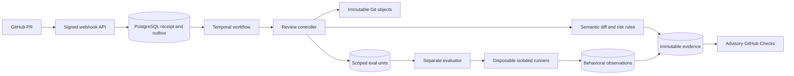

# AgentCI

**An agent-first CI/CD platform and engineering control plane.**

AgentCI is being built for agents as first-class participants in software delivery:
understanding intent, proposing changes, evaluating behavior and coordinating
releases through explicit APIs, policy boundaries and verifiable evidence. Humans
retain visibility and authority over consequential decisions.

The platform connects specifications, pull requests, evaluations, runtime signals
and release decisions. Its first working milestone reviews changes to requirements,
permissions, tools, models, prompts and dependencies, then publishes an advisory
GitHub Check. That is the first capability of the control plane, not its full scope.

[Adapter authoring](docs/adapter-authoring.md) · [Try AgentCI](#quickstart) · [Architecture](#architecture) · [Demo](docs/releases/m2.md) · [Roadmap](docs/milestone-gates.md) · [Contributing](#contributing)

## Why AgentCI?

Agent-driven development needs more than a pipeline that runs commands. Agents
need machine-readable intent, stable interfaces, durable state and feedback they
can use to decide the next action. Reviewers need to see what happened, why, and
which evidence supports a delivery decision. AgentCI aims to connect that loop
across CI/CD while integrating with existing execution and deployment systems.

A passing build tells you whether existing checks passed. It may not explain
whether a prompt lost a safety constraint, a tool gained production-write access,
or a model configuration changed. Those changes can alter an agent's behavior
without looking like a conventional code defect.

AgentCI makes these changes visible and connects each review to exact Git commits
and retained evidence. The goal is a reviewable chain from intended requirements
to observed behavior and release decisions. M1 delivers deterministic semantic PR review; M2 adds behavioral evaluations.
Tracing, production feedback and repair remain later milestones.

## Principles

- **Design for agents first.** Machine-readable contracts, explicit outcomes and
  traceable evidence are primary interfaces; human review remains an authority boundary.
- **Close the delivery feedback loop.** Connect intent, change, evaluation, release
  and runtime feedback so agents can act on evidence within policy.
- **Build on existing systems.** Git owns source history; existing CI executes
  jobs. Temporal coordinates durable workflows. OpenTelemetry and MCP are the
  planned tracing and tool integration standards.
- **Keep evidence tied to identity.** Reviews identify immutable base/head commits,
  producer versions and content digests. Superseded heads cannot satisfy a current review.
- **Separate facts from inference.** An explicit production-write addition can be
  verified structurally. Possible requirement weakening is labeled inferred.
- **Treat repository contents as data.** M1 reviewers never execute PR scripts,
  hooks, dependency installations or evaluation commands with App credentials.
- **Use narrow access and explicit contracts.** The GitHub App uses repository-scoped
  read access plus Checks write; versioned schemas and API behavior are tested.
- **Finish and demonstrate each milestone.** Tests, evals, packaging, documentation,
  publication and downloaded-artifact verification precede phase completion.

## What works today?

Current distribution: [0.3.1-m2](https://github.com/alimobrem/agentci/releases/tag/v0.3.1-m2).
This public immutable prerelease has verified packages and native AMD64/ARM64
images. See [the release evidence and demo](docs/releases/m2.md) and the
[completion ledger](releases/m2-gates.json). AgentCI reviews its own pull requests.

| Available now | Planned in later milestones |
| --- | --- |
| Repository validation and semantic PR review | Independent multi-model review and first dashboard (M3) |
| Impact-selected behavioral evals and frozen baseline assertions | OpenTelemetry instrumentation and MCP enforcement (M4–M5) |
| Isolated command/pytest, Promptfoo/DeepEval and HTTP adapters | Release evidence, production feedback, replay and repair (M6–M10) |
| Durable comparisons, statistical trials and authenticated API/client exports | Production hosting and broader deployment integration |
| Advisory GitHub Checks and public UBI images for AMD64/ARM64 | Tekton/OpenShift integration (M7) |

A neutral Check means the advisory analysis completed; it does not certify
behavioral correctness or authorize deployment. Invalid inputs and infrastructure
failures are reported explicitly. The current deployment is for one repository.

## Behavioral review

M2 compares behavior across exact base/head commits and keeps the baseline
assertions fixed. Published images passed native integration and recovery on both
architectures; the downloaded CLI/client passed real customer acceptance. Follow
the [M2 release record](docs/releases/m2.md) for evidence and limitations.

- Versioned EvalSuite manifests select native commands, pytest, optional
  Promptfoo/DeepEval or registered HTTP providers using impact and requirements.
- Frozen baseline assertions evaluate exact base/head code; deleting or weakening
  a head's suite cannot erase the baseline. Missing execution stays explicit.
- Repeated trials retain pass rates, Wilson intervals, critical failures and
  observed metrics, then report scenario deltas and regressions.
- A separate evaluator runs untrusted commands in disposable non-root containers;
  GitHub App credentials stay in the controller. Docker is the M2 default, with
  UBI service images. Podman adoption remains tracked separately.
- GitHub Checks expose outcomes and retained evidence. Agents retrieve scoped
  comparisons and verified streaming exports through the API/client.

Start with the [M2 customer and release guide](docs/m2-guide.md),
[adapter-authoring guide](docs/adapter-authoring.md),
[comparison API](docs/eval-comparison-api.md) and
[recovery guide](docs/eval-recovery.md). The first web dashboard is planned for M3;
current interfaces are GitHub Checks, CLI operator commands and the API/client.

## Architecture



The TypeScript API durably receives scoped events. Temporal coordinates retries;
workers fetch exact Git objects, analyze bounded data and persist evidence in
PostgreSQL. Before publishing, they recheck the PR's current identity. The evidence
API requires bearer authentication.

For this repository, a trusted main-branch GitHub Actions workflow also runs the
review engine with isolated PostgreSQL/Temporal, uploads evidence before publishing
Checks and reconciles open PRs after events and on a recovery schedule. It runs
independently of the laptop; artifact downloads require GitHub authentication.

Core schemas remain independent of Temporal. Service images use UBI 10 minimal
and Node 26.10.0. See [architecture decisions](docs/architecture.md),
[the OpenAPI contract](specs/api/openapi.json) and [operations](docs/m1-setup.md).

## Quickstart

Requires Node.js **26.10.0 (26.x)** and npm. The CLI is distributed through GitHub
releases; it is not published to the npm registry.

```sh
mkdir agentci-demo
cd agentci-demo
npm init -y
npm install --omit=dev https://github.com/alimobrem/agentci/releases/download/v0.3.1-m2/agentci-0.3.1-m2.tgz
npx agentci --version
# Expected: 0.3.1-m2
```

Initialize a separate empty customer project and validate its contracts:

```sh
npx agentci init --root ../my-agent-project
npx agentci validate --root ../my-agent-project --json
```

Follow the [customer guide](docs/customer-onboarding.md) to register a private App
for one repository and deploy the API/worker. Customers see advisory GitHub Checks;
agents use the authenticated evidence API through `agentci/client`. The CLI
provides bootstrap, setup, validation, local semantic review and submission of a
service-backed review. Follow [the M2 guide](docs/m2-guide.md) to configure the
separate evaluator. There is no standalone CLI `eval` command.

### Service images

Public packages include [API](https://github.com/alimobrem/agentci/pkgs/container/agentci-api),
[controller worker](https://github.com/alimobrem/agentci/pkgs/container/agentci-worker),
[evaluator](https://github.com/alimobrem/agentci/pkgs/container/agentci-eval-worker),
default runner, optional engines and self-eval dependencies.
Use the immutable digests in the [release manifest](https://github.com/alimobrem/agentci/releases/download/v0.3.1-m2/images.json).
Images support linux/arm64 and linux/amd64; UBI 10 amd64 requires x86-64-v3.
Follow the [customer deployment guide](docs/customer-onboarding.md) for PostgreSQL, Temporal,
App permissions and secrets. The Temporal development server is for local use.

## Contributing

Issues and pull requests are welcome. Include a concrete use case or reproducible
failure, the expected behavior and any relevant requirements. Read
[AGENTS.md](AGENTS.md) and the [development guide](docs/development.md) before changing code.

```sh
git clone https://github.com/alimobrem/agentci.git
cd agentci
# Use Node 26.10.0 and npm 12.2.0.
npm ci
npm run check:fast
```

Fast checks provide local feedback. Service changes also need relevant real
PostgreSQL/Temporal integration, API compatibility, packaging and container checks.
Keep contracts, tests and docs aligned. Never commit App keys, tokens or `.env`.
[API quality](docs/api-quality.md) and the [definition of done](docs/definition-of-done.md)
are release requirements.

## Roadmap and project status

There are 11 milestones, M0–M10. M0 contracts and M1 semantic review, including customer
onboarding and agent/API acceptance, are complete. M2 eval orchestration is
published with verified customer and distribution evidence. Its
[release/demo/retrospective record](docs/releases/m2.md) and gate ledger govern
phase completion; M3 remains not-started until closure.

- [Milestones and acceptance scenarios](docs/milestone-gates.md)
- [Current status](STATUS.md) and [release notes](CHANGELOG.md)
- [Full specification](specs/agentci-full-spec.md) and [implementation inventory](specs/implementation-status.md)
- [M1 release verification](docs/releases/m1-onboarding.md) and [retrospective](docs/retrospectives/m1.md)

## License

AgentCI is open-source software licensed under the [MIT License](LICENSE).
